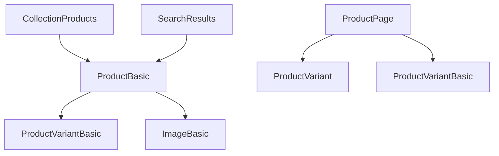

# GraphQL Fragment Management Guide

## Overview

This guide documents the GraphQL fragment organization and naming conventions implemented to resolve naming conflicts in the Watermelon Hydrogen project.

## Problem Background

The project experienced critical GraphQL codegen failures due to duplicate fragment names across different files, causing "Not all operations have a unique name" errors.

## Fragment Naming Strategy

### Global Fragments (`app/lib/fragments.js`)

These fragments are designed for reuse across multiple components and API calls:

```graphql
# Product fragment for basic product data
fragment ProductBasic on Product {
  id
  title
  handle
  availableForSale
  createdAt
  description
  productType
  publishedAt
  tags
  updatedAt
  vendor
  variants(first: 1) {
    edges {
      node {
        ...ProductVariantBasic
      }
    }
  }
  featuredImage {
    ...ImageBasic
  }
  images(first: 20) {
    edges {
      node {
        ...ImageBasic
      }
    }
  }
  seo {
    description
    title
  }
}

# Page fragment for basic page data  
fragment PageBasic on Page {
  id
  title
  handle
  body
  bodySummary
  createdAt
  updatedAt
  seo {
    description
    title
  }
}
```

### Route-Specific Fragments

Each route that needs detailed data defines its own fragment with a descriptive name:

#### Product Pages (`app/routes/products.$handle.jsx`)

```graphql
fragment ProductPage on Product {
  id
  title
  vendor
  handle
  descriptionHtml
  description
  encodedVariantExistence
  encodedVariantAvailability
  options {
    name
    optionValues {
      name
      firstSelectableVariant {
        ...ProductVariant
      }
      swatch {
        color
        image {
          previewImage {
            url
          }
        }
      }
    }
  }
  selectedOrFirstAvailableVariant(selectedOptions: $selectedOptions) {
    ...ProductVariant
  }
  adjacentVariants(selectedOptions: $selectedOptions) {
    ...ProductVariant
  }
  seo {
    description
    title
  }
}

query ProductPage(
  $country: CountryCode
  $handle: String!
  $language: LanguageCode
  $selectedOptions: [SelectedOptionInput!]!
) @inContext(country: $country, language: $language) {
  product(handle: $handle) {
    ...ProductPage
  }
}
```

#### Page Content (`app/routes/pages.$handle.jsx`)

```graphql
query PageContent(
  $language: LanguageCode,
  $country: CountryCode,
  $handle: String!
) @inContext(language: $language, country: $country) {
  page(handle: $handle) {
    id
    title
    body
    seo {
      description
      title
    }
  }
}
```

## Naming Conventions

### Global Fragments
- **Format**: `{EntityName}Basic`
- **Purpose**: Reusable across multiple components
- **Examples**: `ProductBasic`, `PageBasic`, `ImageBasic`, `ProductVariantBasic`

### Route-Specific Fragments  
- **Format**: `{EntityName}{Purpose}`
- **Purpose**: Specific to individual routes/pages
- **Examples**: `ProductPage`, `ProductCard`, `ProductSummary`

### Query Operations
- **Format**: `{EntityName}{Purpose}` or `{Purpose}{EntityName}`
- **Purpose**: Unique operation names for each query
- **Examples**: `ProductPage`, `PageContent`, `CollectionProducts`

## Fragment Dependencies



## File Organization

```
app/
├── lib/
│   └── fragments.js          # Global reusable fragments
├── routes/
│   ├── products.$handle.jsx  # ProductPage fragment + query
│   ├── pages.$handle.jsx     # PageContent query  
│   ├── collections.$handle.jsx # Collection-specific fragments
│   └── search.jsx            # Search-specific fragments
└── components/
    ├── ProductForm.jsx       # Uses ProductBasic
    ├── ProductCard.jsx       # Uses ProductBasic
    └── SearchResults.jsx     # Uses ProductBasic
```

## Import Patterns

### Using Global Fragments

```javascript
// app/routes/api.product.jsx
import { PRODUCT_QUERY, PRODUCT_FRAGMENT } from '~/lib/fragments';

export async function loader({ params, context }) {
  const product = await context.storefront.query(PRODUCT_QUERY, {
    variables: { handle: params.handle }
  });
  return { product };
}
```

### Route-Specific Queries

```javascript
// app/routes/products.$handle.jsx
// Local query defined in same file
const PRODUCT_QUERY = `#graphql
  query ProductPage(...) {
    product(handle: $handle) {
      ...ProductPage
    }
  }
  ${PRODUCT_FRAGMENT}
`;
```

## Validation Rules

### 1. Unique Names
- All fragment names must be unique across the entire project
- All query operation names must be unique across the entire project

### 2. Descriptive Naming
- Fragment names should clearly indicate their purpose and scope
- Avoid generic names like `Product`, `Page`, `Item`

### 3. Consistency
- Follow established naming patterns
- Use consistent capitalization (PascalCase)

### 4. Documentation
- Document complex fragments with comments
- Explain fragment dependencies

## Troubleshooting

### Common Errors

#### "Not all operations have a unique name"
```bash
* Product found in:
- app/lib/fragments.js  
- app/routes/products.$handle.jsx
```

**Solution**: Rename one of the conflicting fragments:
```graphql
# Before
fragment Product on Product { ... }

# After  
fragment ProductBasic on Product { ... }  # in lib/fragments.js
fragment ProductPage on Product { ... }   # in routes file
```

#### "Unknown fragment"
```bash
Unknown fragment "Product"
```

**Solution**: Ensure fragment is imported or defined:
```javascript
import { PRODUCT_FRAGMENT } from '~/lib/fragments';

const QUERY = `#graphql
  query { 
    product { ...ProductBasic }
  }
  ${PRODUCT_FRAGMENT}
`;
```

## Migration Process

When renaming fragments:

1. **Identify all usages** with search
2. **Update fragment definition** 
3. **Update all references** in queries
4. **Update all imports** in JavaScript files
5. **Test build** to verify no conflicts
6. **Update documentation**

## Best Practices

1. **Plan fragment hierarchy** before implementation
2. **Use global fragments** for common data patterns
3. **Create route-specific fragments** for complex page data
4. **Keep fragments focused** on single entity types
5. **Document fragment relationships** and dependencies
6. **Test codegen** after fragment changes

---

**Last Updated**: December 24, 2024  
**Status**: Implemented and Validated ✅
