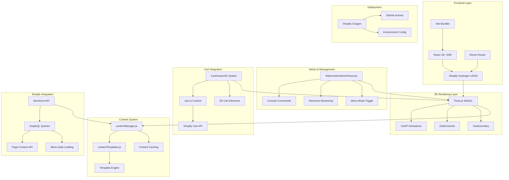
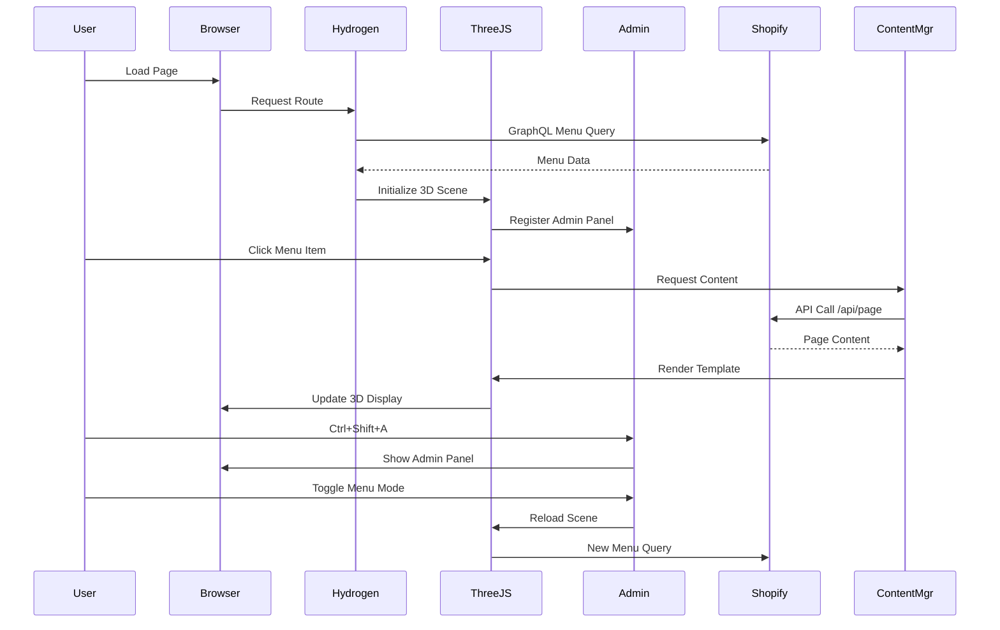
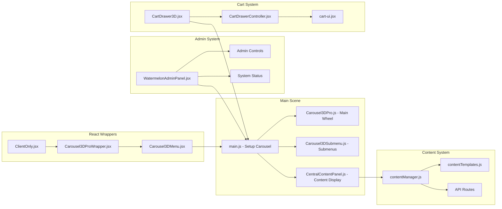

# 🏗️ Watermelon Hydrogen Technical Architecture

## 🎯 System Overview



## 🔄 Data Flow Architecture



## 🎨 Component Architecture



## 📊 File Dependency Matrix

| Component | Dependencies | Exports | Global Exposure |
|-----------|-------------|---------|-----------------|
| `main.js` | Three.js, GSAP, ContentManager | setupCarousel() | window.watermelonAdmin |
| `contentManager.js` | contentTemplates.js | ContentManager class | window.contentManager |
| `WatermelonAdminPanel.jsx` | React, ClientOnly | Admin component | - |
| `CartDrawer3D.jsx` | cart-ui, Shopify hooks | Cart component | window.drawerController |
| `Carousel3DPro.js` | Three.js, TextGeometry | Carousel3DPro class | - |
| `contentTemplates.js` | - | Template functions | - |

## 🔧 Configuration Layers

```yaml
Application Config:
  - vite.config.js: Build configuration
  - package.json: Dependencies & scripts
  - eslint.config.js: Code quality
  - tailwind.config.js: Styling

Environment Config:
  - .env files: API tokens
  - Oxygen deployment: Production settings
  - GitHub Actions: CI/CD pipeline

Shopify Config:
  - Storefront API tokens
  - Menu handles
  - Page content mapping
  - GraphQL fragments

3D Scene Config:
  - Camera settings
  - Animation parameters
  - Material properties
  - Performance settings
```

## 🎯 Integration Points

### **Shopify ↔ Three.js Bridge**
```javascript
// Menu data transformation
Shopify GraphQL → menuTransform.js → 3D Carousel

// Content loading
Menu Click → contentManager.js → Shopify API → Template Render → 3D Display

// Cart integration
3D Cart Click → Event System → React Context → Shopify Cart
```

### **Admin ↔ System Bridge**
```javascript
// Admin panel controls
UI Controls → watermelonAdmin object → 3D Scene Updates

// Real-time monitoring
System Status → Admin Panel → Visual Indicators

// Mode switching
Admin Toggle → localStorage → Scene Reload → New Data Source
```

### **Template ↔ Content Bridge**
```javascript
// Content rendering
Raw Data → Template Selection → HTML Generation → 3D Panel Display

// Interactive elements
Template Buttons → Event Handlers → System Actions (cart, navigation)
```

## 🚀 Performance Architecture

### **Rendering Pipeline**
1. **SSR Phase**: Hydrogen renders React shell
2. **Hydration**: Client-side React takes over
3. **3D Initialization**: ClientOnly mounts Three.js
4. **Content Loading**: Async Shopify data fetch
5. **Template Rendering**: Dynamic content display

### **Memory Management**
- **Three.js Cleanup**: Geometry/material disposal
- **Event Listeners**: Comprehensive removal on unmount
- **Animation Cleanup**: GSAP timeline disposal
- **Cache Management**: Smart content cache expiry

### **Performance Optimizations**
- **Code Splitting**: React.lazy for large components
- **Asset Loading**: Efficient GLTF and texture loading
- **Animation**: RequestAnimationFrame optimization
- **Caching**: Multi-layer content caching strategy

---

*Architecture documented: June 23, 2025*
